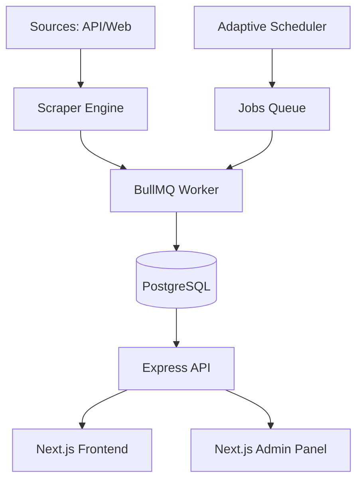

# System Architecture

The Teer Club platform follows a sovereign registry architecture, ensuring strict separation between data collection, administration, and presentation.

## Architecture Diagram

## Module Responsibilities

### 1. Backend (The Engine)
- **Hybrid Scraper**: Coordinates API probes, deep crawls, and AI fallback.
- **Worker Tier**: Offloads heavy scraping tasks from the main thread using BullMQ.
- **API Tier**: Provides RESTful endpoints for games, sources, and verified results.
- **Real-time Layer**: Uses SSE (Server-Sent Events) to push live result updates.

### 2. Admin Panel (The Command Center)
- **Service Control**: Toggle scrapers, start/stop schedulers.
- **Data Integrity**: Audits results, corrects date-shifts, and updates source urls.
- **Health Monitoring**: Real-time metrics on worker performance, tokens used, and success rates.

### 3. Frontend (The Portal)
- **Dynamic Dashboard**: Responsive grid showing real-time results for all games.
- **Static Content**: SEO-optimized pages for guidebooks and historical archives.
- **Real-time Tickers**: Low-latency updates using the backend event stream.

## Data Flow (Winning Number Journey)
1. **Detection**: Hybrid engine identifies a new result on a source page.
2. **Standardization**: Validator cleanses the input (e.g., `xx` -> `XX`, `shillong` -> `Shillong`).
3. **Guard Logic**: System checks if the result matches high-confidence historical data to prevent "Date-Shift" errors.
4. **Persistence**: Result is saved with a confidence level (LOW -> MEDIUM -> HIGH -> CONFIRMED).
5. **Broadcast**: Event emitted to the EventSource stream; Frontend updates instantly.
