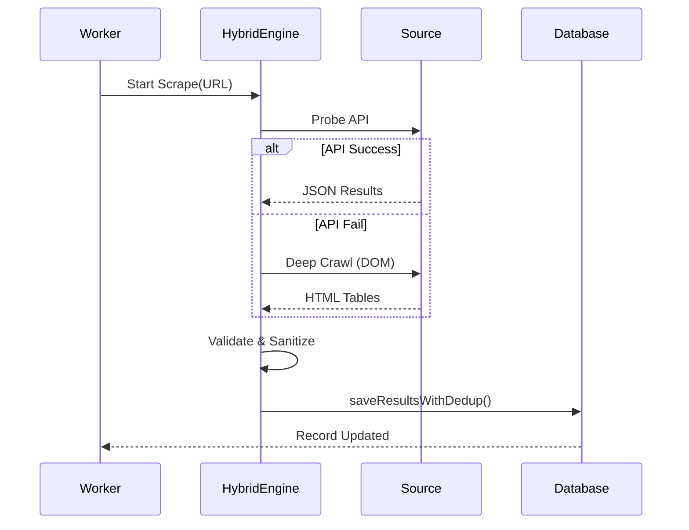

# Backend Jobs & Scraping Engine

Teer data extraction is a multi-stage automated process designed for 100% accuracy and zero downtime.

## 1. Active Working Jobs

### A. Scraper Worker (`scraperWorker.ts`)
- **Type**: BullMQ Job Handler.
- **Data Source**: Official source URLs defined in `registry.ts`.
- **Extraction Logic**:
    1. **API Probe**: Tries to find JSON endpoints (highest accuracy).
    2. **Deep Crawl**: If API fails, performs BFS traversal of the site using Cheerio.
    3. **AI Fallback**: If DOM parsing fails, sends relevant text snippets to OpenAI for extraction.
- **Verification**: Only marks a result as `CONFIRMED` if matching data is found across multiple independent sources or cycles.

### B. Adaptive Scheduler (`adaptiveScheduler.ts`)
- **Schedule**: Variable (5s to 5min).
- **Execution Flow**:
    - **IST Morning**: Slow polling (Inactive).
    - **IST Afternoon (14:30 - 18:30)**: High-speed polling (Active). Every 5 seconds.
    - **Cooldown**: Drops to 2-minute polling once all Results for the day are `CONFIRMED`.
    - **Night Reset**: Resets scraping metrics and clears local cache.

### C. Midnight Sync Job (`index.ts`)
- **Schedule**: `0 0 * * *` (Daily).
- **Purpose**: Ensures the system is ready for the next day's numbers. Purges old logs and resets "today's" pointers.

## 2. Extraction Flow

## 3. Data Integrity Policies
- **Single Source of Truth**: Prioritizes verified APIs (e.g., ShillongTeerGround) over standard HTML tables.
- **Date-Shift Protection**: Prevents today's results from overwriting yesterday's data by comparing strings against a verified historical baseline.
- **Lowercase Normalization**: Standardizes `xx`, `XX`, `--` into `XX` for database consistency.
- **Confidence Scoring**: 
    - `LOW`: Single source match (DOM).
    - `MEDIUM`: Single source match (API).
    - `HIGH`: Multiple sources matching.
    - `CONFIRMED`: Manually verified or highly stable across cycles.
